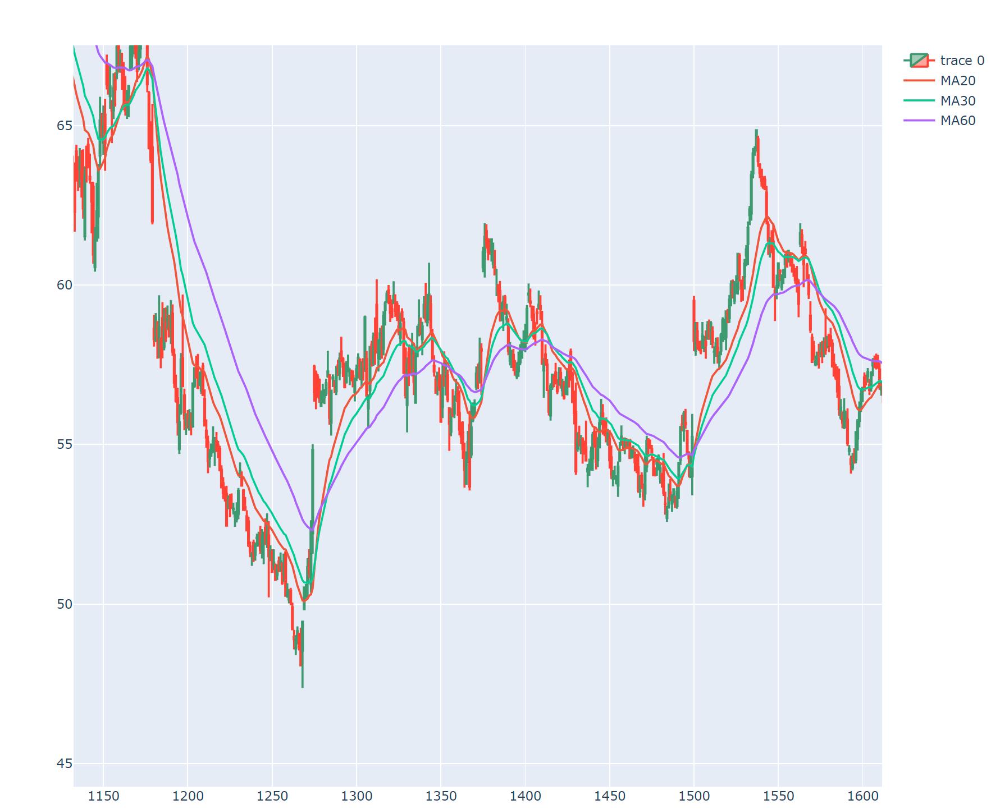

# QuantWiseAI

## AI based application with a purpose of price forecasting

### In depth analysis of Performance of various machine learning models

### Chart Pattern Recognition

## Current status:

### 1. Preparation and Research (11.6.2023)

### 2. Implementation of Resistant and Support levels (16.6.2023)

#### SBUX

- Support levels are marked with green lines
- Resistance levels are marked with red lines

- Purpose of this is to find a safe entry point for a long position (buying a stock)

### 3. Implementation of Trading Chanels (22.6.2023)

- Trading channels are represented with

  - Green lines for raising channels
  - Red lines for falling channels

- Purpose of this is to find a channel in which the price is moving

### 4. Implementation of Moving Averages (23.6.2023)

- Moving averages are represented with
  - Orange line for 20 day moving average
  - Green line for 30 day moving average
  - Purple line for 60 day moving average

### 5. Implementation of ARIMA CHANNELS

- ARIMA channels are represented with
  - BLue line for upper channel
  - Blue line for lower channel

### 6. Implementation of RSI

- Implementation of RSI indicator
- Up to 20% return on investment
  

- RSI is represented with - Orange line for RSI - Blue line for prices
  

### 7. Implementation of VOLD RATIO
  - Implementation of VOLD RATIO indicator
  - Up to 25% return on investment

- Explantion
  - Basis = Middle line (Yellow)
  - Upper line = Upper Area (Green)
  - Lower line = Lower Area (Red)
  - Close = Blue line
